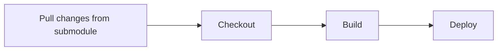
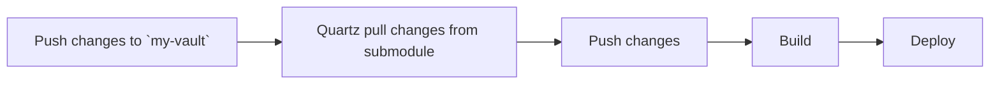

Quartz effortlessly publishes your notes written in `Markdown` and Obsidian

With Quartz, all markdown files need to exist within `content` folder. This means that you have to either:
1. Have your Obsidian vault sit inside `content` folder
2. Use symlink

Key issue I found is that with existing Obsidian vaults, we have to move over the entire vault into `content` folder or create a *new* one as suggested [here](https://notes.nicolevanderhoeven.com/How+to+publish+Obsidian+notes+with+Quartz+on+GitHub+Pages#Step+3.+Create+an+Obsidian+vault)

How can we *decouple* Quartz and Obsidian vault, and improve on the workflow so that we only have to worry about our notes and our site gets updated automatically?

---

>[!info] Pre-requisites
>- [Quartz](https://quartz.jzhao.xyz/) has a comprehensive tutorial on basic set up. This serves to build upon and improve Quartz’s workflow
>- Obsidian
>- Comfortable with `Git`

---

Let’s say there is a *standalone* Obsidian vault called `my-vault`
>[!warning]- What if the only vault I have is within `content` folder in Quartz
>Simply copy out the folder as a new vault. Clear the `content` folder in Quartz

### Step 1: Create a GitHub repository for your vault
1. Go to GitHub and create a new repository for your Obsidian vault.
2. Push `my-vault` to this new repository.

### Step 2: Add your vault repo as a submodule in Quartz
1. Navigate to your Quartz repository locally.
2. Add your Obsidian vault repository as a submodule inside the `content` folder:
	```bash
	git submodule add https://github.com/<user>/my-vault.git
	```
3. Initialize and update the submodule:
	```bash
	git submodule update --init --recursive
	```

### Step 3: Update `npx quartz sync` command
With the above changes, Quartz and `my-vault` is better decoupled. However, with any changes pushed to `my-vault` repo, running `npx quartz sync` will not reflect any changes on GitHub pages. This is because submodules do not always reference the latest commit. `npx quartz sync` command then needs to:
1. Update submodules and merge all remote changes *(new)*
2. Push the changes *(pre-existing)*
3. Deploy the changes *(pre-existing)*

In `quartz/cli/handlers.js`:
```js
const commitMessage = argv.message ?? `Quartz sync: ${currentTimestamp}`
// add this command
spawnSync("git", ["submodule", "update", "--remote", "--merge", "content"], {
  stdio: "inherit",
})
spawnSync("git", ["add", "."], { stdio: "inherit" })
spawnSync("git", ["commit", "-m", commitMessage], { stdio: "inherit" })
```

With this, we have achieved classical use of Quartz with submodules within the repository. However, this also means that we need to manage 2 repos. For example, any changes made to Markdown files need to be pushed to `my-vault` repo. Then, run `npx quartz sync`. How can we ignore the need to manage Quartz repo and only focus on `my-vault`?

### Step 4: Set up GitHub Actions

This is where we will automate most of our workflow. Currently, the GitHub Actions in Quartz should allow you to checkout changes, build and deploy to GitHub Pages. A high level overview of the modified GitHub Actions should look like this:

**Quartz repo**


However, we can further improve this by using GitHub Actions API. Any changes made to `my-vault` can trigger a workflow in Quartz repo using `repository dispatch`

**Workflow Overview**


#### `my-vault` actions
The workflow should notify Quartz repo that there are changes:
##### `trigger.yaml`
```yaml
name: Trigger digitalgarden
on:
  push:
    branches:
      - main

jobs:
  trigger:
    runs-on: ubuntu-latest

    steps:
      - name: Trigger Workflow in digitalgarden repository
        run: |
          # Set the required variables
          repo_owner=${{ secrets.DIGITALGARDEN_OWNER }}
          repo_name=${{ secrets.DIGITALGARDEN_REPO_NAME }}
          event_type="trigger-workflow"

          curl -L \
            -X POST \
            -H "Accept: application/vnd.github+json" \
            -H "Authorization: Bearer ${{ secrets.PAT }}" \
            -H "X-GitHub-Api-Version: 2022-11-28" \
            https://api.github.com/repos/$repo_owner/$repo_name/dispatches \
            -d '{"event_type":"trigger-workflow"}'

```

#### Quartz repo workflow

The workflows in Quartz repo should be able to:
1. Listen for changes in the `my-vault` repo
2. Pull changes from submodule
3. Update (push) changes
4. Build and deploy

The following `yaml` file pull changes from the submodule and pushes the changes to Quartz repo. The workflow is triggered when there is a `repository_dispatch` of a trigger that we just defined:

##### `sync.yaml`
```yaml
name: Sync submodule
on:
  repository_dispatch:
    types:
      - trigger-workflow
jobs:
  update-submodule:
    runs-on: ubuntu-22.04
    permissions:
      contents: write
      pull-requests: write
    steps:
      - name: Checkout repository
        uses: actions/checkout@v4
        with:
          token: ${{ secrets.PAT_TOKEN }}
          submodules: recursive
      - name: Authorize Git
        run: |
          git config --global user.email "$GITHUB_ACTOR@github.com"
          git config --global user.name "$GITHUB_ACTOR"
      - name: Update submodule
        run: |
          git submodule update  --init --recursive --remote
      - name: Commit changes
        run: |
          git add --all
          git commit -m "Update submodule to latest commit" || echo "No changes to commit"
          git push
```

In the build and deploy step, there are not much changes. Add `submodules: recursive` to let GitHub Actions know that there is a submodule:

##### `deploy.yaml`
```

```yaml
jobs:
  build:
    runs-on: ubuntu-22.04
    steps:
      - uses: actions/checkout@v3
        with:
          submodules: recursive
          token: ${{ secrets.PAT_TOKEN }}
          fetch-depth: 0
```

>[!example]- Why is `sync` not added in `deploy` as a job instead?
>If `sync` is within `deploy` as a job, this means that `deploy` will run on pushes to `v4` branch *and* `repository_dispatch`
> Notice that when changes from submodule is pulled, it has to be pushed to the main repo for the changes to be reflected in the build and deploy step.
> 
> Therefore, if `sync` is within `deploy` as a step, `sync` will perform `git push`. Since there is a `git push`, this will create new actions. This means that for a single change in `my-vault` repo, there will be 1 action that is redundant and 1 action (from `git push` in `sync`) that updates the deployment.
> 
> Therefore, it is cleaner for `sync` to perform `git push` and let `deploy` react to `git push` event.