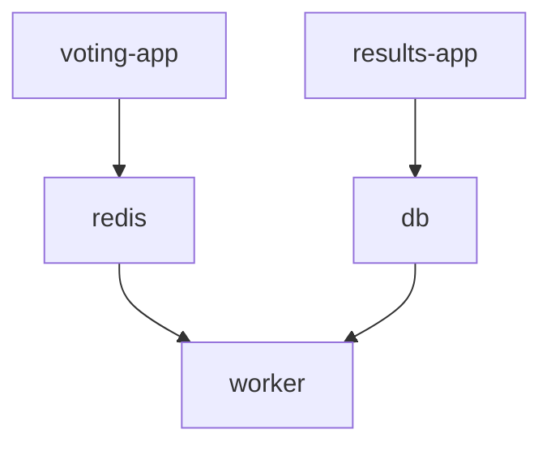

We want to run multiple containers as services.

Instead of `docker run` multiple times, create a `docker-compose.yml` and dictionary the different containers services

```yaml
services:
	web:
		image: <image>
	database:
		image: <image>
	messaging:
		image: <image>
	orchestration:
		image: <image>
```

Then,
```bash
docker-compose up
```

All the services run within the same Docker host.

---

# Voting application
>> An example by Docker. Can be found [here](https://github.com/dockersamples/example-voting-app/tree/main)



The application consists of: 
- Voting app : interface in Python for users
- Redis : In-mem DB
- Worker : .NET
- DB : PostgreSQL
- Result app : Web interface in Node.js

## How to run on a single Docker engine with `docker run`?
Assume all images are built and avaiable

1. Start with the containers
	1. Add `-d` flag to run in the background

```bash
docker run -d --name=redis redis
docker run -d --name=db postgres
```

2. Start the application containers
	1. Map the ports so that we can access the app

```bash
docker run -d --name=vote -p 5000:80 voting-app
docker run -d --name=result -p 5001:80 result-app
```

3. Run the worker container

```bash
docker run -d --name=worker worker
```

However, running the containers are not enough to get everything working.

We need to tell the worker, for example, to link `redis` and `db`. To make the `worker` aware of the `redis` container, add `--link` flag

This creates an entry in the `/etc/hosts` file with an entry named `redis` and the internal IP of the container.

```bash
docker run -d --name=worker worker --link db:db --link redis:redis
```

However, this may soon be `depracated`.

## `docker compose`

To use `docker compose` for the above configuration,

```yaml
redis:
	image: redis
db:
	image: postgres:9.4
vote:
	image: voting-app
	ports:
		- 5000:80
	links:
		- redis
result:
	image: result-app
	ports:
		- 5001:80
	links:
		- db
worker:
	image: worker
	links:
		- db
		- redis
```

Then, run `docker compose up` to bring up the entire application stack.

---

## Building
Note that the image may not be on the registry. Then, instead of `image`, use `build` and the directory to the image.

## Versions

`version 2` supports order of container to start. It is encapsulated in `services`

```yaml
version: 2
services:
	redis:
		image: redis
	db:
		image: postgres:9.4
	vote:
		image: voting-app
		ports:
			- 5000:80
		depends_on:
			- redis

	result:
		image: result-app
		ports:
			- 5001:80

	worker:
		image: worker
```

- Creates a dedicated bridge network for this application
- `depends_on` specifies the order to start

`version 3` supports Docker swarm.

It also creates a network between the containers. Therefore, you no longer need to use `links` between the containers.

## Networks

How to create a front-end network to handle user traffic and back-end network to handle internal traffic?

```yaml
version: 2
services:
	redis:
		image: redis
		networks:
			- back-end
	db:
		image: postgres:9.4
		networks:
			- back-end
	vote:
		image: voting-app
		ports:
			- 5000:80
		depends_on:
			- redis
		networks:
			- front-end
			- back-end
	result:
		image: result-app
		ports:
			- 5001:80
		networks:
			- front-end
			- back-end
	worker:
		image: worker
		networks:
			- backend

networks:
	front-end:
	back-end:
```