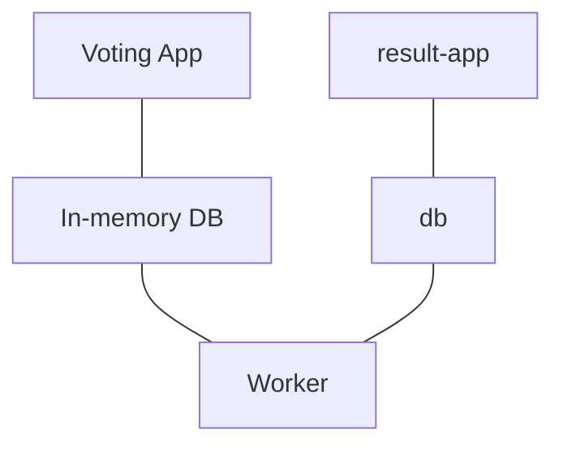

# Microservices Architecture

## Sample application

The sample application is built with different tools and different platforms (for example, Node, .NET, redis, postgreSQL)

### Deploying on Kubernetes
1. Deploy containers on Kubernetes cluster
2. Enable connectivity between the containers
3. Enable external access for frontend

Each component is deployed as pod, replica set or deployment.

Once the pods are deployed, enable connectivity between the services.

>[!note] What are the requirements of the connectivity?
>For example, the `voting-app` writes to the `redis` database and the `worker` reads from `redis`
>
>The `worker` is not being accessed by any other component

>[!note]
>Both `voting-app` and `result-app` listens on port `80`

#### Making service accessible by another
>[!caution]
>The IP addr of the pod can change if the pod restarts

Services expose application to another application or to external users.

**Exposing to other services**
- Create Services (ClusterIP) for `redis` and `db`

Services are named so that other services can open connection to these services with the connection string.

**Exposing to external users**
- Create Services (NodePort) for `voting-app` and `result-app`

`Worker` does not require a service

>[!note]
>Service is only required if the application has process or database that needs to be exposed to be accessed by others

---

# Deploying with Kubernetes Deployment

Deployments are chosen over ReplicaSets as deployments create ReplicaSets, and are able to perform rolling updates, record and rollback changes.

1. Create Deployment using the pod definition file as the template
