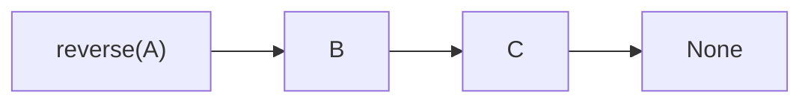
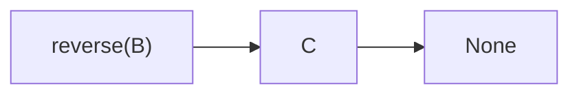
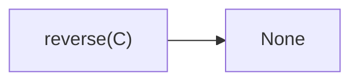
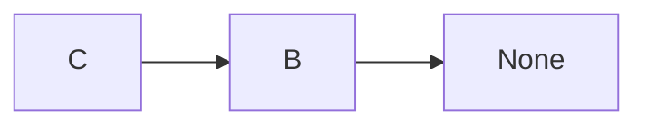
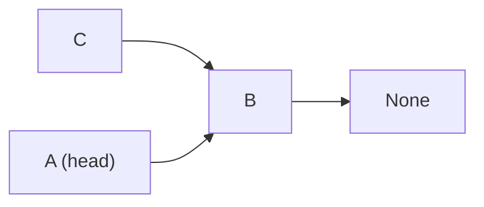
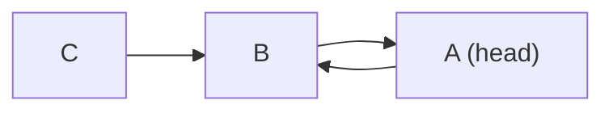
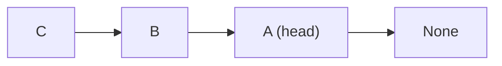
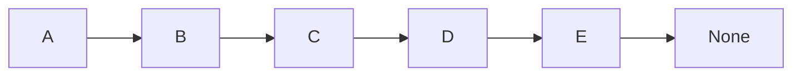
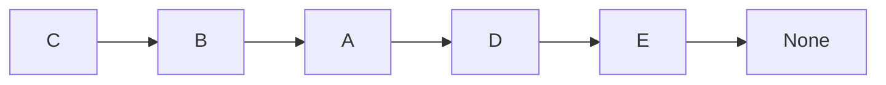

# Linked List 1

Given the `head` of a linked list, reverse the list, and return the reversed list.

## Iteration

To reverse a linked list via iteration, maintain 3 pointers:
- `curr_node`
- `prev_node` : Preceding node relative to `curr_node`
- `next_node` : Succeeding node relative to `curr_node`

Modify the 3 pointers to reverse a linked list:
- `curr_node.next` has to point to `prev_node`
- However, this destroys the reference to the next node to continue with the iteration
- Therefore, we need to store the reference to the next node with `next_node`
- Update the `prev_node` to `curr_node` and `curr_node` to `next_node`

```python
# Definition for singly-linked list.
# class ListNode:
#     def __init__(self, val=0, next=None):
#         self.val = val
#         self.next = next
class Solution:
    def reverseList(self, head: Optional[ListNode]) -> Optional[ListNode]:
	    # Early return : Empty linked list
        if head is None:
            return head

		# Early return : Linked list with 1 node
        if head.next is None:
            return head

        curr_node = head
        prev_node = None
        next_node = None

        while curr_node is not None:
            # Store reference to next node
            next_node = curr_node.next
            # Update curr_node.next
            curr_node.next = prev_node
            # update pointers
            prev_node = curr_node
            curr_node = next_node
        return prev_node
```

>[!note] Why is `prev_node` returned?
>At the last iteration, `curr_node` is the last node and `next_node` is `None`. Therefore, after updating the pointers, `curr_node` would point to `None` and `prev_node` would point to the last node

## Recursion

```python
class Solution:
    def reverseList(self, head: Optional[ListNode]) -> Optional[ListNode]:
	    if head is None:
		    return head
		if head.next is None:
			return head
		last = self.reverseList(head.next)
		head.next.next = head
		head.next = None
		return last
```

**Original linked list**


**1st Recursive call on `head.next = B`**


**2nd Recursive call on `head.next = C`**


Since `C.next` is `None`, return the `C`

---

**In 1st recursive call**
`last = C`
`head.next.next = head` essentially updates `C.next` to `B`
`head.next = None` removes the reference from `B -> C`


Therefore, in the 0-th recursive call, after 1st recursive call returns, we essentially have:


Then, `head.next.next = head` updates `B.next` to `A`



Then, `head.next = None` finally reverses the list:


`last = C` is returned which is indeed the head of the reversed linked list.

>[!example]- Formal proof
>#### Preconditions:
>1. The input is a singly linked list with nodes connected via `next` pointers.
>2. The list can be empty (`head is None`), consist of a single node, or contain multiple nodes.
>
>#### Postconditions:
>1. The linked list is reversed such that all `next` pointers are reversed.
>2. The function returns the new head of the reversed linked list.
>
>#### Proof by Induction:
>
>##### **Base Case (n = 0 or n = 1):**
>- **Case 1:** If `head is None` (empty list), the function returns `head`, which is `None`.
>  - **Result:** The function correctly returns an empty list.
>- **Case 2:** If `head.next is None` (single-node list), the function returns `head`.
>  - **Result:** The list is already reversed (as a single-node list is the same when reversed).
>
>Thus, the function correctly handles the base cases of an empty list and a single-node list.
>
>##### **Inductive Hypothesis:**
>Assume that for a list with `n` nodes, the function `reverseList(head)` correctly reverses the list and returns the new head.
>
>##### **Inductive Step:**
>Consider a list with `n + 1` nodes, where `n ≥ 1`.
>
>1. **Function Call:**
>   - We call `reverseList(head)` where `head` points to the first node of the list.
>   - Since `head.next is not None`, the function proceeds with `last = reverseList(head.next)`.
>
>2. **Recursive Call on Sublist:**
>   - The sublist starting at `head.next` has `n` nodes.
>   - By the inductive hypothesis, the recursive call `reverseList(head.next)` correctly reverses this sublist.
>   - Let's denote the reversed sublist as `last`, which is now the head of this reversed sublist.
>
>3. **Reversing the Current Node:**
>   - After the recursive call returns, the original list is now reversed from `head.next` to the last node.
>   - The statement `head.next.next = head` sets the `next` pointer of the last node of the reversed sublist to point back to `head`, thereby appending `head` to the end of the reversed list.
>   - The statement `head.next = None` ensures that `head` is now the last node in the reversed list (by removing its old `next` pointe).
>
>4. **Returning the New Head:**
>   - Finally, the function returns `last`, which is the head of the newly reversed list.
>
---

# Linked List 2
Given the `head` of a linked list, reverse the first `n` nodes.

Suppose the linked list:


`reverseN(A, 3)` should result in:



```python
def reverseN(head: Optional[ListNode], n: int) -> Optional[ListNode]:
	if n == 1:
		successor = head.next
		return head
	last = reverseN(head.next, n-1)
	head.next.next = head
	head.next = successor
	return last
```

>[!example]- Formal proof
>#### Preconditions:
>1. The input is a singly linked list with nodes connected via `next` pointers, and an integer `n` denoting number of nodes from `head` to be reversed
>2. The list can be empty (`head is None`), consist of a single node, or contain multiple nodes.
>
>#### Postconditions:
>1. The linked list is reversed such that the first `n` nodes’ `next` pointers are reversed.
>2. The function returns the new head of the reversed linked list.
>
>#### Proof by Induction:
>
>##### **Base Case (n = 1):**
>- If `n = 1` (ie reverse the first node), the function returns `head` which is the original linked list. This is correct as reversing 1 node is equivalent to not reversing.
>
>Thus, the function correctly handles the base case of reversing only first node.
>
>##### **Inductive Hypothesis:**
>Assume that for a list with `m` nodes, the function `reverseN(head.next, n-1)` correctly reverses the first $n-1$ nodes in the list starting from `head.next`.
>
>##### **Inductive Step:**
>Consider $n$ where `n > 1`.
>
>1. **Function Call:**
>   - We call `reverseN(head, n)` where `head` points to the first node of the list.
>   - Since `n > 1`, the function proceeds with `last = reverseN(head.next, n-1)`.
>
>2. **Recursive Call on Sublist:**
>   - The sublist starting at `head.next` has `n-1` nodes.
>   - By the inductive hypothesis, the recursive call `reverseN(head.next, n-1)` correctly reverses this sublist.
>   - Let's denote the reversed sublist as `last`, which is now the head of this reversed sublist.
>
>3. **Reversing the Current Node:**
>   - After the recursive call returns, the original list is now reversed from `head.next` to the last node.
>   - The statement `head.next.next = head` sets the `next` pointer of the last node of the reversed sublist to point back to `head`, thereby appending `head` to the end of the reversed list.
>   - The statement `head.next = successor` ensures that `head` is now the next of $n$-th node (by removing its old `next` pointe).
>
>4. **Returning the New Head:**
>   - Finally, the function returns `last`, which is the head of the newly reversed list.
>

---

# Linked List 3

Given an interval $[m, n], $1$-based index, only reverse the elements in this section.

```python
def reverseBetween(head: Optional[ListNode], m: int, n: int) -> Optional[ListNode]
```

- If `m == 1`, then, it is the same as reversing the first $n$ elements

**What if $m \neq 1$?**
If we take the index of the `head` as $1$, then we compared to `head.next` the reverse section should start from $m-1$-th element

```python
def reverseBetween(head: Optional[ListNode], m: int, n: int) -> Optional[ListNode]:
	if m == 1:
		return reverseN(head, n)
	head.next = self.reverseBetween(head.next, m-1, n-1)
	return head
```