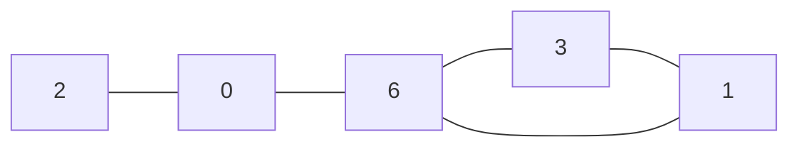
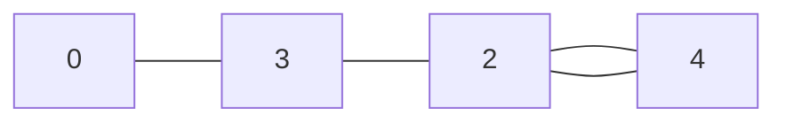

Also known as the *Tortoise and the hare algorithm*, Floyd’s cycle finding algorithm detects cycles within a [list](Lists.md).

Most commonly, it uses a slow pointer referencing index $i$ and a fast pointer referencing index $2 * i$ of the collection.

# Simple intuition

Suppose for a linked list $A = [ 2, 0, 6, 3, 1, 6 ]$. We know that the linked list can be represented as a cycle:

>[!caution]
>Note that the algorithm only ensures that the fast and slow pointers will match again at some position in the list. In other words, the fast and slow pointer will match at some position within the cycle.

In the presence of a duplicate element, the duplicate corresponds to the *starting* point of the cycle.

From the starting point, the slow pointer will move through the cycle until it reaches the duplicate. By then, the fast pointer would have lapped and match with the slow pointer again.

# Find the duplicate number

Suppose we have the array $A = [a_1, ... , a_{n+1}]$ and $a_i = [1, n]$

To detect cycle in the array, take $i$ as the index of the array and $a_i$ as the node that $i$ is pointing to.

For example, for $A= [1, 3, 4, 2, 2]$ corresponds to:

When we have found the cycle, intialize a new pointer at the start of the list and leave a pointer within the cycle.

When the pointer reaches the 

