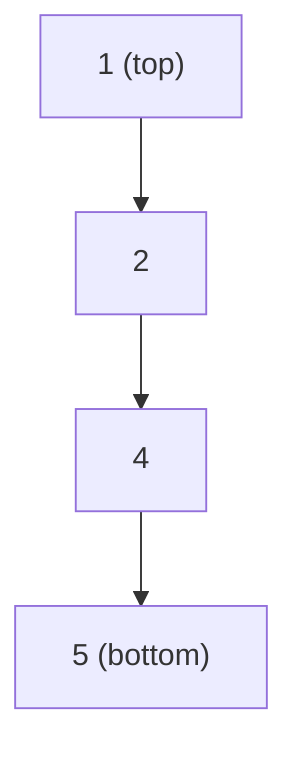
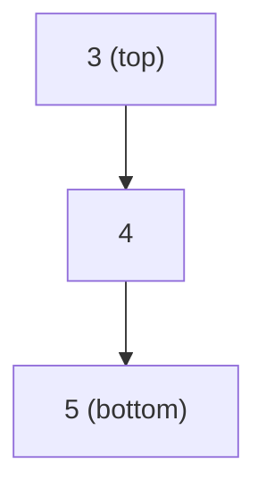
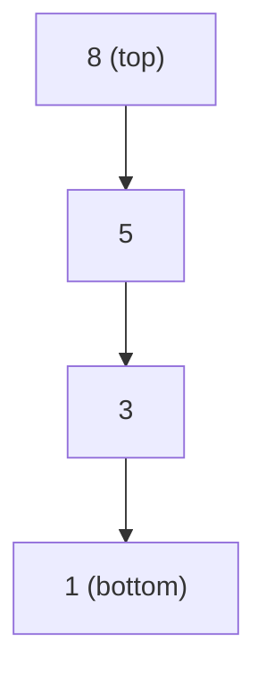

A *monotonic* stack is a stack whose elements are monotonically ==increasing== or ==decreasing==

**Decreasing monotonic stack**
Suppose we want to push a new element. If we need to pop *smaller* elements from the stack, then it is a decreasing monotonic stack from bottom to top.

For a decreasing monotonic stack,

To push `3`, pop all smaller or equal elements ie `[1, 2]`

**Increasing monotonic stack**
Suppose we want to push a new element. If we need to pop *larger* elements from the stack, then it is an increasing monotonic stack

For an increasing monotonic stack,

To push `4`, pop all larger or equal elements ie `[8, 5]`
