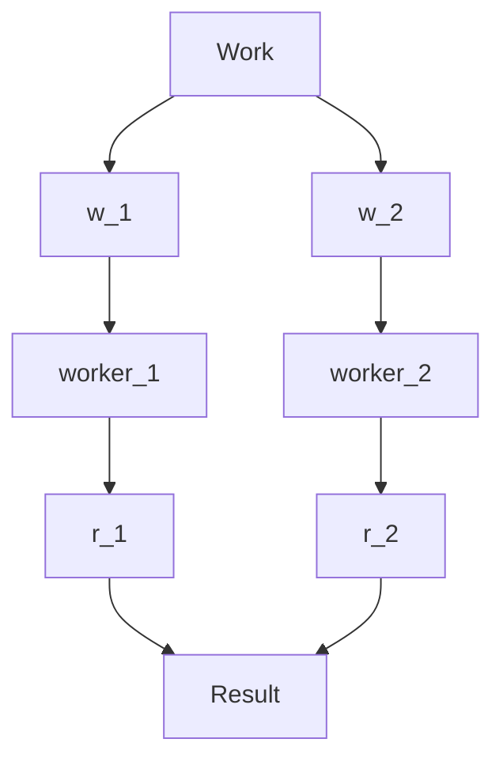

>> The datacenter *is* the computer

- Learn the ==storage== and ==memory== architecture
- Cost of moving data in the data center
	- Because the volume is so big, it will exceed the boundary of a single machine. So you have to move data between multiple machines
---
# Architecture

>[!note] The datacenter is the computer
>Many machines in a data center is logically one processing unit instead of independent machines

## Building blocks
### Server
- *Plate* server
- Specially optimised for energy efficiency
- Compact
### Server rack
- A rack contains dozens of servers
- Connected with a **rack switch**

### Cluster
- Connected server racks
- Connected with a **cluster switch**

>[!caution]
>In this module, only assume 1 level of cluster switch. However, you can have more than 1 level of cluster switches.
## Storage

**Local DRAM** : Main memory

>[!important] 
>Latency of the disk is $10^3$ more than the latency of the DRAM.

### Bandwidth and Latency
**Bandwidth** : Maximum amount of data that can be transmitted per unit time ($GB/s$)

**Latency** : time taken for 1 packet to go from source to destination (*one way*) or from source to destination and back to source (*round trip*) in $ms$

>[!caution]
>In this module, we are only concerned with *one-way* latency

- Transferring a large amount of data → bandwidth matters more
- Transferring a small amount of data → latency matters more

>[!example]
>Consider a highway
>
>When we add more lanes, we are increasing the bandwidth. However, the distance to a destination remains the same → latency remains the same

>[!note]
>**Throughput** refers to the rate at which some data was *actually* transmitted across the network during some period of time
## Moving data

>[!note]
>Moving one data from a machine to another depends on the location and the number of components it has to cross.

- A data access may cross several components including hard disk, DRAM, network (rack switch and cluster switch etc)

We are only approximating scale or the order of magnitude, rather than the exact number.

### Simplifications
- One way communication (data → program)
- *No failures*
	- Transfer is always successful

### Latency
- The latency accumulates → *sum* of latency caused in **all** components in the data access

Suppose we are accessing in a local machine from the disk:
$$
\text{latency} = 100ns + 10ms \approx 10ms
$$

### Bandwidth
- The *minimum* of the bandwidths of all components in the data access (the bottleneck)
- Assume the hardware peak bandwidth
- the actual achieved bandwidth (throughput) depends on the algorithm

>[!example] Data access in local machine (same machine)
>Suppose a program in the main memory tries to retrieve data.
>
>**Case 1** : Accessing from DRAM
>- latency = latency of DRAM = $100ns$
>- bandwidth = bandwidth of DRAM = $20GB/s$
>
>**Case 2** : Accessing from disk
>- latency = latency of DRAM + latency of disk $=100ns + 10ms \approx 10ms$
>- bandwidth = $min$(bandwidth of DRAM, bandwidth of disk) $=\min(20GB/s, 200MB/s) = 200MB/s$

>[!example] Data accesses within the same rack
>Suppose a program is in the main memory of a server. But, the data it is trying to access is in another machine in the **same server rack**
>
>Suppose rack switch (per port)
>- Latency $= 300us$
>- Bandwidth $= 100MB/s$ (similar to disk)
>
>$$DRAM << Rack switch << Disk$$ 
>in terms of latency
>
>**Case 1: DRAM of current machine → Rack switch → DRAM of another machine**
>- In this route, the latency of *rack switch* is larger than latency of DRAM $\implies$ latency $\approx 300 us$
> 	 - Latency = $100ns + 300us + 100ns \approx 300us$
>- The minimum of bandwidth on this route $\implies$ $min$(bandwidth of rack switch, bandwidth of DRAM) $\approx 100 MB/s$
>
>**Case 2: DRAM of current machine → Rack switch → DRAM of another machine → Disk of another machine**
>- Between rack switch and disk, the latency of the disk is larger $\implies$ latency $\approx 10ms$
>- The minimum bandwidth on this route $\implies$ bandwidth $\approx 100 MB/s$

>[!example] Data accesses in different racks
>Suppose datacenter switch (per port)
>- Latency $= 500us$
>- Bandwidth $= 10MB/s$
>
>**DRAM of current machine → Rack switch → Datacenter switch → Rack switch → DRAM of another machine**
>- Latency = $2 * \text{rack switch} + \text{datacenter switch} \approx (500 + 300 * 2) = 1300us$
>- Bandwidth $= 10MB/s$ (bottleneck at datacenter switch)
>
>**DRAM of current machine → Rack switch → Datacenter switch → Rack switch → DRAM of another machine → Disk of another machine**
>- Latency = Latency of disk $\approx 10ms$
>- Bandwidth $\approx 10MB/s$ (bottleneck at datacenter switch)

### Capacity of storage hierarchy

1. Disk has much higher capacity than DRAM
	- Although hard disk is low, disk has a much higher capacity, less expensive and not volatile.
	- DRAM is volatile → memory will be lost if you power the machine off.
2. **Storage hierarchy**
	- Capacity increases as we go from local server to rack to datacenter
3. Disks reads are ==more expensive== than DRAM — both in terms of latency (higher latency) and bandwidth (lower bandwidth)
4. **Cost** increase over the storage hierarchy: **latency increases** as we go from local to rack to datacenter
5. **Cost** increase over the storage hierarchy: **bandwidth decreases** as we go from local to rack to datacenter

>[!note]
>Point 4 and 5 occurs because the bottleneck becomes the rack switch then the datacenter switch
>

---
# Efficient big data systems

The **FOUR** principles:
1. Scale out, not up
	- Combining many *cheaper* machines, horizontal scaling
	- Avoid single point of failure
	- Adding more servers to your architecture to spread the workload across more machines
		- But you can still scale *up* each individual node
		- Example: Adding more powerful GPUs to each node
1. Seamless scalability
	- If processing a certain dataset takes 100 machine hours, ideal scalability is to use a cluster of 10 machines to do it in about 10 hours
	- The design must **scale linearly** to the number of machine
	- Actually very hard to achieve
1. Move processing to the data
	- Avoid the “distance” between program and data 
	- Clusters have limited bandwidth — Move the task to the machine where the data is stored
	- **Assumption**: The program is significantly smaller than the data
	- Need to know where the data is
	- Need to know if the machine with data can accept the job/ load
1. Process data sequentially, avoid random access
	- Seeks are expensive, disk throughput is reasonable
---
# Abstractions
## Machine failures
- One server stay up 10 years
- If there are 3650 servers, lose 1 server per day

>[!note]
>Machine failure is not an exception. It is actually expected and is a *law*
## Software failures
- Wrong Java versions, OS patches etc
- **Most common** : Out of memory failure (OOM failure), memory fragmentation
## Synchronisation

- Order in which workers run
- Workers interrupt each other
- Workers need to communicate partial results
- Workers need to access shared data

## Challenges
- How do we assign work units to workers?
- What if we have more work units than workers?
- What if workers need to share partial results?
- How do we aggregate partial results?
- How do we know all the workers have finished?
- What if workers die/ fail?

---

# Programming difficulty
==Concurrency== is difficult to reason about
- at the scale of data centers and across data centers
- in the presence of failures
- in terms of multiple interacting services (microservices)
	- Naturally forms the dependency between the services → difficult to find out where is the bug

---

>[!note] The datacenter is the computer
>What is the right level of abstraction?
>- What is the instruction set (or API) of the datacenter computer
>
>Hide system-level details from the developers
>- No more race conditions, lock contention
>- No need to explicitly worry about reliability, fault tolerance
>
>Separating the *what* from the *how*
>- Developer specifies the *computation* that needs to be performed
>	- They may know what they want, but not necessarily what is the underlying computation
>- Execution framework handles actual execution

