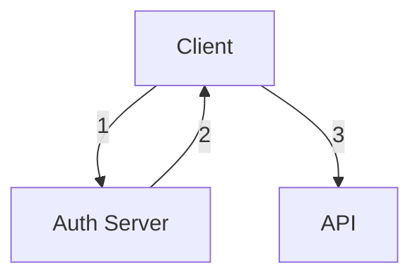
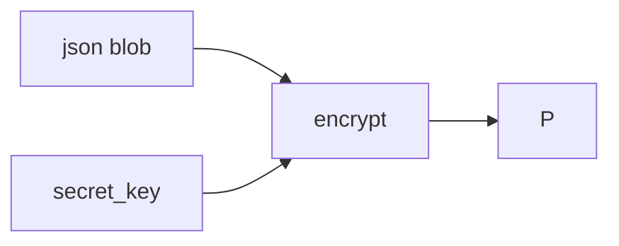
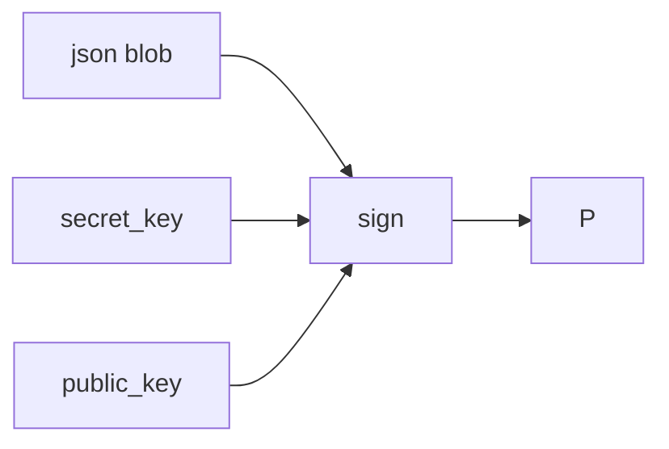

# Token based authentication
Token-based authentication provides a secure and efficient way to manage user access in modern apps.

**Typical flow of token based authentication**:
1. **User login** : User provides credentials to the application
2. **Authentication** : Application validates these credentials against a database (for example, checking hashed password with `bcrypt`) verifying the user’s identity
3. **Token generation** : Successful auth –> App generates a unique digitally signed token containing relevant user info and permissions
4. Token is sent to client over HTTP in response header (or body)
5. **Client-side storage** : Client securely stores the received token in local storage, cookies etc for subsequent use
6. **Token verification** : When a request with token is received, the server confirms its validity and integrity by utilizing the token’s signature
7. **Access control** : Based on the validated token, the server determines whether the client has the necessary authorization to access teh requested resource.

>[!note] References
> [JWT and PASETOs](https://permify.co/post/jwt-paseto/)


# JSON Web Token (JWT)
JWT is an open standard that defines a *compact* and *self-contained* way of securely transmitting between parties as a JSON object.

The JSON object can be verified and trusted because it is digitally *signed*. JWTs are signed using a **secret** with the HMAC algorithm or a public/private key pair using *RSA* or *ECDSA*.

>[!note] Signing vs encrypting a token
>- *Signed* tokens can verify the **integrity** of the claims contained within it
>- *Encrypted* tokens **hide** those claims from other parties
>
>The signature also certifies that only the party holding the private key is the one that signed it.

---

## Use cases
### Authentication
When a user successfully logs in using their credentials, an *ID token* is returned.
- According to OIDC specs, an ID token is always a JWT

### Authorization
>[!warning] Not **authentication**

Once a user is logged in, subsequent requests will include the JWT. This allows a user to access routes, services and resources that are permitted with that token.

Examples:
- Single Sign On (SSO)

### Information Exchange
JWTs can securely transmit information between parties.

JWTs are signed using public/private key pairs $\implies$ can assert that senders are who they say they are.

*Signature* is calculated using the **header** and the **payload** $\implies$ able to verify that the content has not been tampered with.

---

## Structure
JWTs consist of 3 parts:
1. Header
2. Payload
3. Signature

### Header
Header has 2 parts:
1. Type of token
2. Signing algorithm used

```json
{
	"alg": "HS256",
	"typ": "JWT"
}
```

>[!note] RS256 vs HS256
>- HS256 is default for clients
>- RS256 is default for APIs
>  
>  #### HS256 (Symmetric keys)
>  - Generates a symmetric MAC → must share a secret with any client or API that wants to verify the JWT
>  - Secret is used for both signing and verifying the JWT
>  - **There is no way to guarantee that auth server generated the JWT** as any client or API with the secret could generate a validly signed JWT
>
> #### RS256 (Asymmetric keys)
> - Generates asymmetric signature: a *private* key is used to sign the JWT, a different public key is used to *verify*


### Payload
Payload contains *claims*. Claims are statements about the user and additional data.

There are 3 types of claims: *registered, public, and private* claims.

#### Registered claims
- Not mandatory but recommended
- Examples are `iss` (issuer) , `exp` (expiry), `sub` (subject), `aud` (audience)

#### Public claims
- Defined at will

#### Private claims
- Custom claims created to share information between parties that agree on using them

```json
{
	"sub": "1234567890",
	"name": "John Doe",
	"admin": true
}
```

### Signature
To create a signature
1. take each `base64url` encoding of `headers` and `payload`
2. Generate a secret
3. Sign with the algorithm specified in the header

## Authentication
When user successfully logs in using their credentials, JWT is returned.

>[!warning] You should not keep tokens longer than required (use `exp`)

When the user wants to access a protected route or resource, the user agent sends the JWT in `Authorization: Bearer <jwt-token>`

>[!note]
>Keep JWTs small, some servers has a size limit for headers (~8KB)

>[!note]
>CORS will not be an issue as it does not use cookies



1. Application requests authorization to auth server.
2. When auth is granted, auth server returns an access token to the application
3. The application uses access token to access a protected resource (API)

>[!warning] Do not put secret information within the token

---

## JSON Web Key (JWK) Set

JWKS is a set of keys containing the *public* keys that should be used to verify any JWT issued by the authorization server.

#### JWK
A JSON object that represents a cryptographic key. Members of the object represent *properties* of the key and its value.

#### JWK Set
A JSON object that represents a *set* of JWKs. JWKS **must** have `keys` member which is an array of JWKs.


The following JWKS contains a single JWK:

```js
{
"keys": [
  {
    "alg": "RS256",
    "kty": "RSA",
    "use": "sig",
    "x5c": [   "MIIC+DCCAeCgAwIBAgIJBIGjYW6hFpn2MA0GCSqGSIb3DQEBBQUAMCMxITAfBgNVBAMTGGN1c3RvbWVyLWRlbW9zLmF1dGgwLmNvbTAeFw0xNjExMjIyMjIyMDVaFw0zMDA4MDEyMjIyMDVaMCMxITAfBgNVBAMTGGN1c3RvbWVyLWRlbW9zLmF1dGgwLmNvbTCCASIwDQYJKoZIhvcNAQEBBQADggEPADCCAQoCggEBAMnjZc5bm/eGIHq09N9HKHahM7Y31P0ul+A2wwP4lSpIwFrWHzxw88/7Dwk9QMc+orGXX95R6av4GF+Es/nG3uK45ooMVMa/hYCh0Mtx3gnSuoTavQEkLzCvSwTqVwzZ+5noukWVqJuMKNwjL77GNcPLY7Xy2/skMCT5bR8UoWaufooQvYq6SyPcRAU4BtdquZRiBT4U5f+4pwNTxSvey7ki50yc1tG49Per/0zA4O6Tlpv8x7Red6m1bCNHt7+Z5nSl3RX/QYyAEUX1a28VcYmR41Osy+o2OUCXYdUAphDaHo4/8rbKTJhlu8jEcc1KoMXAKjgaVZtG/v5ltx6AXY0CAwEAAaMvMC0wDAYDVR0TBAUwAwEB/zAdBgNVHQ4EFgQUQxFG602h1cG+pnyvJoy9pGJJoCswDQYJKoZIhvcNAQEFBQADggEBAGvtCbzGNBUJPLICth3mLsX0Z4z8T8iu4tyoiuAshP/Ry/ZBnFnXmhD8vwgMZ2lTgUWwlrvlgN+fAtYKnwFO2G3BOCFw96Nm8So9sjTda9CCZ3dhoH57F/hVMBB0K6xhklAc0b5ZxUpCIN92v/w+xZoz1XQBHe8ZbRHaP1HpRM4M7DJk2G5cgUCyu3UBvYS41sHvzrxQ3z7vIePRA4WF4bEkfX12gvny0RsPkrbVMXX1Rj9t6V7QXrbPYBAO+43JvDGYawxYVvLhz+BJ45x50GFQmHszfY3BR9TPK8xmMmQwtIvLu1PMttNCs7niCYkSiUv2sc2mlq1i3IashGkkgmo="
    ],
    "n": "yeNlzlub94YgerT030codqEztjfU_S6X4DbDA_iVKkjAWtYfPHDzz_sPCT1Axz6isZdf3lHpq_gYX4Sz-cbe4rjmigxUxr-FgKHQy3HeCdK6hNq9ASQvMK9LBOpXDNn7mei6RZWom4wo3CMvvsY1w8tjtfLb-yQwJPltHxShZq5-ihC9irpLI9xEBTgG12q5lGIFPhTl_7inA1PFK97LuSLnTJzW0bj096v_TMDg7pOWm_zHtF53qbVsI0e3v5nmdKXdFf9BjIARRfVrbxVxiZHjU6zL6jY5QJdh1QCmENoejj_ytspMmGW7yMRxzUqgxcAqOBpVm0b-_mW3HoBdjQ",
    "e": "AQAB",
    "kid": "NjVBRjY5MDlCMUIwNzU4RTA2QzZFMDQ4QzQ2MDAyQjVDNjk1RTM2Qg",
    "x5t": "NjVBRjY5MDlCMUIwNzU4RTA2QzZFMDQ4QzQ2MDAyQjVDNjk1RTM2Qg"
  }
]}
```

With the following members:
- `alg` : Algorithm type for the key
- `kty` : Key type
- `use` : How the key was meant to be used (`sig` represents signature verification)
- `x5c` : x509 cert chain
- `e` : Exponent
- `n` : Modulo
- `kid` : Unique identifier for the key
- `x5t` : thumbprint of the cert

### How JWTs are validated with JWKS
1. Retrieve the JWKS and filter for potential signature verification keys
2. Extract the JWT from the request’s authorization header
3. Decode the JWT and grab the `kid` property from the header
4. Find the signature verification key in the filtered JWKS that matches the `kid` property
5. Using `x5c` property, build a certificate which will be used to verify the JWT signature
6. Ensure JWT contains the expected audience, issuer, expiration etc

---

## Case study: MongoDB Realm with Clerk
In my project, I used MongoDB Realm with Clerk (authorization provider).

MongoDB Realm provides mechanisms for custom JWT authentication.


### MongoDB Realm
- Use JWK URI of Clerk
- Map metadata from JWT to fields of a user
- `Audience` value must map to `aud` field of JWT

### Clerk
- Acquire JWKS URI
- Create custom JWT claims to include user metadata
```json
{
	"id": "{{user.id}}",	
	"aud": "https://quick-mite-52.accounts.dev/",
	"name": "{{user.username}}",
	"role": "authenticated",
	"email": "{{user.primary_email_address}}"
}
```

>[!note]
>Other claims are automatically added by Clerk

# Problems with JWT

### Weak algorithms
- Give developers too many algos to choose
- Some algos are known to be vulnerable

### Trivial Forgery
- Set `alg` to `None` to bypass validation
- Set  `alg` to a symmetric one while server normally verifies token with RSA public key
	- Server’s RSA public key is known to the public
	- Attacker create a fake token with symmetric algo and signs with server’s public key

In server code, need to validate token algo to one that the server uses

>[!note]
>JWT is suitable for SSO, but not to manage user sessions in their web applications
>
>References:
>- [Stop using JWT for sessions](http://cryto.net/~joepie91/blog/2016/06/13/stop-using-jwt-for-sessions/)
>- [Stop using JWT for sessions Part 2](http://cryto.net/%7Ejoepie91/blog/2016/06/19/stop-using-jwt-for-sessions-part-2-why-your-solution-doesnt-work/)
>- [Why JWTs are dangerous for user sessions](https://redis.io/blog/json-web-tokens-jwt-are-dangerous-for-user-sessions/)

So far, we have seen *stateless* JWT. A *stateful* JWT contains just a reference or ID for the session. The session data is stored server-side.

>[!warning]
>JWT vs cookies comparison does not make sense — cookies are *storage mechanisms*. JWTs are *cryptographically signed tokens*
>
>The correct comparison is *sessions vs JWT* and *cookies vs Local storage*

**How to use sessions for authentication**
- [sessions](https://gist.github.com/joepie91/cf5fd6481a31477b12dc33af453f9a1d)

---

# PASETO
>[!note] PASETO stands for Platform Agnostic Security Tokens

PASETO solves a lot of security problems with the JWT specification.

PASETOs are designed as single-use tokens, meant to securely transmit JSON data over the web. This allows you to *securely* transmit JSON data over insecure channels

PASETO is a base64 encoded string of a blob of JSON data:

```json
{
  "exp": "2019-10-09T13:59:13-07:00",
  "id": "59e5d078-8783-4c64-bed2-3c759e47b477",
  "name": "Randall Degges",
  "permissions": [
    "download:file-a.mp4",
    "download:file-b.mp4",
    "download:file-c.mp4"
  ]
}
```

Which is encoded to give:

```bash
v2.local.<payload>.<footer>
```

where `v2` specifies the **protocol version** of PASETO and `local` denotes that the **purpose** is *local*

The **payload** is an encrypted blob of JSON data. If you have the right key, you can decrypt and view the original JSON data.

The *optional* **footer** is used to store additional metadata, unencrypted.

>[!note] Local vs Public
>PASETOs are used for 2 different purposes:
>- symmetric (`local`)
>- asymmetric (`public`)

---

## Local PASETO


Local PASETO are always created and encrypted using a secret key. The local PASETO can then be decrypted using the *same* secret key you used to create it.

>[!note] As long as the *secret key* is kept safe, PASETO is safe, even if it is shared publicly

Because the token is encrypted, attackers cannot see payload data without secret key.
Because the token is authenticated, attackers cannot modify your token without you knowing about it

## Public PASETO
Public PASETO are for environments where you cannot safely share a secret key with all parties involved in a transaction.

Public PASETO is not encrypted but are digitally signed.

If an attacker gets a hold of public PASETO, they will be able to see the data it contains but will not be able to modify without you knowing about it.



When the token has been created, you can also share the *public key* to validate the token. Anyone who has a copy of the public key is able to verify the validity of the token.

---

## PASETO claims

Similar to JWT, PASETO may also contain *claims* (which are just JSON keys)

```json
{
  "eyeColor": "brown",
  "height": "6'0",
  "weight": "220lbs"
}
```

The `eyeColor`, `height`, `weight` are *claims* in the token.

>[!caution]
>There are *reserved* claims that you cannot use for any purpose other than their official purposes

---

## Problems solved

### Local PASETOs

Suppose we have a web application that consists of 2 different services: a website that powers user and purchase flow, and a book download service that allows users to download.

Both the website and services run on a server-side backend can safely store a shared secret key.

When a user purchases an item, the website will generate a local PASETO token that includes details about the users’ purchase.

The website will then redirect users to the catalog service with PASETO in the URL param. The download service will parse the `token` param of the URL, decrypt the local PASETO. The download service is able to validate/ invalidate the purchase.

### Public PASETO
Transmit JSON data in such a way that other people can tell the JSON data was created by you.

Let’s say you’re building and securing a website using a protocol like [OpenID Connect](https://developer.okta.com/blog/2017/07/25/oidc-primer-part-1). In this scenario, you have:

- A user
- A website that a user wants to log into
- An authorization server that controls user logins and permissions

The way authentication might work using public PASETOs in this flow is as follows.

1. A user visits the website and clicks login
2. The user is redirected to the authorization server to log in (`https://id.example.com/login`)
3. The user enters their credentials into a web form to authenticate
4. The authorization server validates the user’s credentials and creates a public PASETO using a private key that only the authorization server has access to. This PASETO will include a claim that provides a user identifier.
5. The authorization server then redirects the user to the website with the public PASETO as a URL parameter (`https://example.com/dashboard?token=v2.public.xxx`)
6. The website receives the user’s request for the dashboard page and parses the PASETO out of the `token`URL parameter
7. The website validates the PASETO and then creates a long-lived session for the user using secure cookies and standard server-side session management flows
8. The user is now authenticated into the website using a PASETO to make the authentication flow possible

>[!note]
>- The public PASETO was only used once: to inform the website that the user has successfully authenticated
>- Website has access to auth server’s *public key*
>- When a user’s *session* expires and the user needs to re-authenticate, the website will then redirect the user back to auth server to re-authenticate

---

## PASETOs are not…
**Reusable tokens**
- PASETO should only be used once

**Long lived access tokens** in web authentication flows

>[!example]
>For example, many developers rely on token-based authentication flows that work something like this:
>
>- A user sends their username and password to a website
>- The website validates the user’s credentials
>- The website generates a JSON Web Token that contains the user’s information and expires in one day
>- The user then stores the JWT in the browser
>- When the user makes subsequent requests to the website, the user sends this JWT to the website to identify itself
>- The website parses out the JWT, validates it locally (makes sure it hasn’t been tampered with and isn’t expired), then allows the request to be completed
>
>In this flow, the website uses the JWT as identity proof for the user **multiple times** (_it’s used every time the user needs to make another request to the website_).
>
>This is a scenario in which you would _not_ want to use a PASETO, as there is no way to prevent an attacker who has the PASETO (_or JWT for that matter_) from using it themselves to impersonate the user or cause other security issues.
>
>Many developers implement the authentication pattern above as a way to speed up their applications by removing the need to perform server-side session management, but this comes at great risk for abuse.

---

# PASETOs vs JWT

PASETOs were actually designed to work around various issues in the JWT specification:
- [Being widely misused](http://cryto.net/~joepie91/blog/2016/06/13/stop-using-jwt-for-sessions/) in ways that impact web security
- Forcing implementations to [strictly adhere](https://tools.ietf.org/html/rfc7515#section-4.1.1) to processing the `alg` header. This allows attackers to modify the `alg` value and change the signature verification method to something different than what was originally intended, thereby making token forging a real possibility.
- Allowing [poor cryptography choices](https://paragonie.com/blog/2017/03/jwt-json-web-tokens-is-bad-standard-that-everyone-should-avoid) in the JSON Web Encryption specification (JWE) that allow attackers to attack encrypted tokens in a variety of ways.

---

