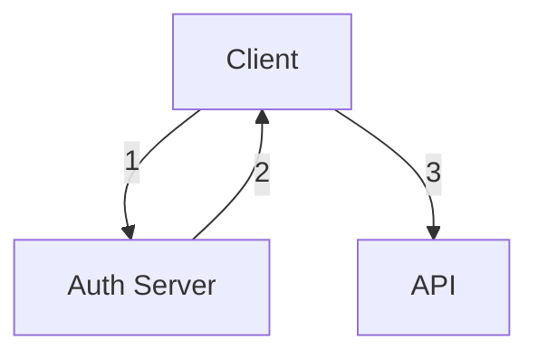

# JSON Web Token (JWT)
JWT is an open standard that defines a *compact* and *self-contained* way of securely transmitting between parties as a JSON object.

The JSON object can be verified and trusted because it is digitally *signed*. JWTs are signed using a **secret** with the HMAC algorithm or a public/private key pair using *RSA* or *ECDSA*.

>[!note] Signing vs encrypting a token
>- *Signed* tokens can verify the **integrity** of the claims contained within it
>- *Encrypted* tokens **hide** those claims from other parties
>
>The signature also certifies that only the party holding the private key is the one that signed it.

---

## Use cases
### Authentication
When a user successfully logs in using their credentials, an *ID token* is returned.
- According to OIDC specs, an ID token is always a JWT

### Authorization
>[!warning] Not **authentication**

Once a user is logged in, subsequent requests will include the JWT. This allows a user to access routes, services and resources that are permitted with that token.

Examples:
- Single Sign On (SSO)

### Information Exchange
JWTs can securely transmit information between parties.

JWTs are signed using public/private key pairs $\implies$ can assert that senders are who they say they are.

*Signature* is calculated using the **header** and the **payload** $\implies$ able to verify that the content has not been tampered with.

---

## Structure
JWTs consist of 3 parts:
1. Header
2. Payload
3. Signature

### Header
Header has 2 parts:
1. Type of token
2. Signing algorithm used

```json
{
	"alg": "HS256",
	"typ": "JWT"
}
```

>[!note] RS256 vs HS256
>- HS256 is default for clients
>- RS256 is default for APIs
>  
>  #### HS256
>  - Generates a symmetric MAC → must share a secret with any client or API that wants to verify the JWT
>  - Secret is used for both signing and verifying the JWT
>  - **There is no way to guarantee that auth server generated the JWT** as any client or API with the secret could generate a validly signed JWT
>
> #### RS256
> - Generates asymmetric signature: a *private* key is used to sign the JWT, a different public key is used to *verify*


### Payload
Payload contains *claims*. Claims are statements about the user and additional data.

There are 3 types of claims: *registered, public, and private* claims.

#### Registered claims
- Not mandatory but recommended
- Examples are `iss` (issuer) , `exp` (expiry), `sub` (subject), `aud` (audience)

#### Public claims
- Defined at will

#### Private claims
- Custom claims created to share information between parties that agree on using them

```json
{
	"sub": "1234567890",
	"name": "John Doe",
	"admin": true
}
```

### Signature
To create a signature
1. take each `base64url` encoding of `headers` and `payload`
2. Generate a secret
3. Sign with the algorithm specified in the header

## Authentication
When user successfully logs in using their credentials, JWT is returned.

>[!warning] You should not keep tokens longer than required (use `exp`)

When the user wants to access a protected route or resource, the user agent sends the JWT in `Authorization: Bearer <jwt-token>`

>[!note]
>Keep JWTs small, some servers has a size limit for headers (~8KB)

>[!note]
>CORS will not be an issue as it does not use cookies



1. Application requests authorization to auth server.
2. When auth is granted, auth server returns an access token to the application
3. The application uses access token to access a protected resource (API)

>[!warning] Do not put secret information within the token

---

## JSON Web Key (JWK) Set

JWKS is a set of keys containing the *public* keys that should be used to verify any JWT issued by the authorization server.

#### JWK
A JSON object that represents a cryptographic key. Members of the object represent *properties* of the key and its value.

#### JWK Set
A JSON object that represents a *set* of JWKs. JWKS **must** have `keys` member which is an array of JWKs.


The following JWKS contains a single JWK:

```js
{
"keys": [
  {
    "alg": "RS256",
    "kty": "RSA",
    "use": "sig",
    "x5c": [   "MIIC+DCCAeCgAwIBAgIJBIGjYW6hFpn2MA0GCSqGSIb3DQEBBQUAMCMxITAfBgNVBAMTGGN1c3RvbWVyLWRlbW9zLmF1dGgwLmNvbTAeFw0xNjExMjIyMjIyMDVaFw0zMDA4MDEyMjIyMDVaMCMxITAfBgNVBAMTGGN1c3RvbWVyLWRlbW9zLmF1dGgwLmNvbTCCASIwDQYJKoZIhvcNAQEBBQADggEPADCCAQoCggEBAMnjZc5bm/eGIHq09N9HKHahM7Y31P0ul+A2wwP4lSpIwFrWHzxw88/7Dwk9QMc+orGXX95R6av4GF+Es/nG3uK45ooMVMa/hYCh0Mtx3gnSuoTavQEkLzCvSwTqVwzZ+5noukWVqJuMKNwjL77GNcPLY7Xy2/skMCT5bR8UoWaufooQvYq6SyPcRAU4BtdquZRiBT4U5f+4pwNTxSvey7ki50yc1tG49Per/0zA4O6Tlpv8x7Red6m1bCNHt7+Z5nSl3RX/QYyAEUX1a28VcYmR41Osy+o2OUCXYdUAphDaHo4/8rbKTJhlu8jEcc1KoMXAKjgaVZtG/v5ltx6AXY0CAwEAAaMvMC0wDAYDVR0TBAUwAwEB/zAdBgNVHQ4EFgQUQxFG602h1cG+pnyvJoy9pGJJoCswDQYJKoZIhvcNAQEFBQADggEBAGvtCbzGNBUJPLICth3mLsX0Z4z8T8iu4tyoiuAshP/Ry/ZBnFnXmhD8vwgMZ2lTgUWwlrvlgN+fAtYKnwFO2G3BOCFw96Nm8So9sjTda9CCZ3dhoH57F/hVMBB0K6xhklAc0b5ZxUpCIN92v/w+xZoz1XQBHe8ZbRHaP1HpRM4M7DJk2G5cgUCyu3UBvYS41sHvzrxQ3z7vIePRA4WF4bEkfX12gvny0RsPkrbVMXX1Rj9t6V7QXrbPYBAO+43JvDGYawxYVvLhz+BJ45x50GFQmHszfY3BR9TPK8xmMmQwtIvLu1PMttNCs7niCYkSiUv2sc2mlq1i3IashGkkgmo="
    ],
    "n": "yeNlzlub94YgerT030codqEztjfU_S6X4DbDA_iVKkjAWtYfPHDzz_sPCT1Axz6isZdf3lHpq_gYX4Sz-cbe4rjmigxUxr-FgKHQy3HeCdK6hNq9ASQvMK9LBOpXDNn7mei6RZWom4wo3CMvvsY1w8tjtfLb-yQwJPltHxShZq5-ihC9irpLI9xEBTgG12q5lGIFPhTl_7inA1PFK97LuSLnTJzW0bj096v_TMDg7pOWm_zHtF53qbVsI0e3v5nmdKXdFf9BjIARRfVrbxVxiZHjU6zL6jY5QJdh1QCmENoejj_ytspMmGW7yMRxzUqgxcAqOBpVm0b-_mW3HoBdjQ",
    "e": "AQAB",
    "kid": "NjVBRjY5MDlCMUIwNzU4RTA2QzZFMDQ4QzQ2MDAyQjVDNjk1RTM2Qg",
    "x5t": "NjVBRjY5MDlCMUIwNzU4RTA2QzZFMDQ4QzQ2MDAyQjVDNjk1RTM2Qg"
  }
]}
```

With the following members:
- `alg` : Algorithm type for the key
- `kty` : Key type
- `use` : How the key was meant to be used (`sig` represents signature verification)
- `x5c` : x509 cert chain
- `e` : Exponent
- `n` : Modulo
- `kid` : Unique identifier for the key
- `x5t` : thumbprint of the cert

### How JWTs are validated with JWKS
1. Retrieve the JWKS and filter for potential signature verification keys
2. Extract the JWT from the request’s authorization header
3. Decode the JWT and grab the `kid` property from the header
4. Find the signature verification key in the filtered JWKS that matches the `kid` property
5. Using `x5c` property, build a certificate which will be used to verify the JWT signature
6. Ensure JWT contains the expected audience, issuer, expiration etc

---

## Case study: MongoDB Realm with Clerk
In my project, I used MongoDB Realm with Clerk (authorization provider).

MongoDB Realm provides mechanisms for custom JWT authentication.


### MongoDB Realm
- Use JWK URI of Clerk
- Map metadata from JWT to fields of a user
- `Audience` value must map to `aud` field of JWT

### Clerk
- Acquire JWKS URI
- Create custom JWT claims to include user metadata
```json
{
	"id": "{{user.id}}",	
	"aud": "https://quick-mite-52.accounts.dev/",
	"name": "{{user.username}}",
	"role": "authenticated",
	"email": "{{user.primary_email_address}}"
}
```

>[!note]
>Other claims are automatically added by Clerk

---

# PASETO
>[!note] PASETO stands for Platform Agnostic Security Tokens

PASETO solves a lot of security problems with the JWT specification


