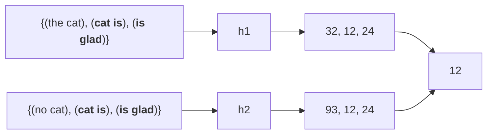

# Similarity search
- Many problems can be expressed as finding *similar* objects

**Examples**
- Pages with similar words
- Customers who purchased similar products
- Users who visited similar websites
# Similarity metric

We define *near neighbours* as points that are *small distance* apart.

**Examples**
- Euclidean distance
- Manhattan distance
- Cosine similarity
## Jaccard similarity
Defined as similarity between 2 **sets**
$$
s_{\text{Jaccard}}(A, B) = \frac{|A \cap B|}{|A \cup B|}
$$

## Jaccard distance
$$
d_{\text{Jaccard}}(A, B) = 1 - s_{\text{Jaccard}}(A, B)
$$

---
# Similar documents
## Goals
- **All pairs similarity** : Given a large number of $N$ documents, find all *near duplicate* pairs (ie Jaccard distance below a certain threshold)
- **Similarity search** : Given a query document $D$, find all documents which are *near duplicates* with $D$

## Applications
- Mirror websites or approximate mirrors
- Similar news articles — cluster articles by *same story*

---
## Essential steps
1. **Shingling** : Convert documents to sets of short phrases
	- >[!note] Why not just words?
	> A set of words assume that there is no order and loses a lot of meaning.
	- User defines the length of phrase
		- Longer document → longer shingles
		- Shorter document → shorter shingles
2. **Min-Hashing** : Convert these sets to short *signatures* of each document, while preserving similarity
	- Signature is a short piece of information that represents the set
	- Block of data representing the contents in a compressed way
	- Documents with the same signature are candidate pairs


---
# Shingles
*k-gram* for a document is a sequence of $k$ tokens that appears in the document

>[!note]
>`token` can be character, word or sentence

>[!example]
>For $k=2$ and the sentence “The cat is glad”
>
>$S(D_1) = \{ the cat, cat is, is glad \}$

Each document $D_1$ can be thought of as a set of its $k-shingles$.


- Often represented as a matrix where columns represent documents and shingles represent rows
- We measure similarity between documents with ==Jaccard similarity== (pairwise)

Jaccard similarity,
$$
sim(D_1, D_2) = \frac{| C_1 \cap C_2 |}{| C_1 \cup C_2 |}
$$
Given two documents columns, bitwise intersection over bitwise union.

>[!caution] Similarity metric with shingles 
>Since the comparison is pairwise, the number of similarities comparison is $N(N-1) / 2$ comparisons. For large vocabulary size (number of rows), it will be too slow.

---
# MinHash
- Fast approximation to the result of using Jaccard similarities to compare all documents.
- Instead of comparing high dimensional data, just compare the signature generated by the hash function
- `MinHash` convert **large sets** to **short signatures** while **preserving similarity**

==Key idea== : hash each column to a small signature $h(C)$ such that:
1. $h(C)$ is small enough that the signature ==fits in RAM==
2. highly similar documents usually have the same signature

==Goal== : Find a hash function such that:
- If $sim(C_1, C_2)$ is high, then with high probability, $h(C_1) = h(C_2)$
- If $sim(C_1, C_2)$ is low, then with high probability, $h(C_1) \neq h(C_2)$

>[!example]
>1. Given a set of shingles ==(the cat), (cat is), (is glad)==
>2. Hash function $h$ maps each shingle to an integer
>3. Compute the min of these $\min(h_1, h_2, h_3)$



>[!note]
>The probability that two documents have the same MinHash signature is equal to their Jaccard similarity
>
>$$
>Pr[h(C_1) = h(C_2)] = sim(C_1, C_2)
>$$

- Documents with the same `MinHash` signature are *candidate pairs*
---
## Extension
- Use $N$ hash functions to generate $N$ signatures for each document.
- Candidate pairs can be defined as those matching a *sufficient number* among these signatures, for example, 50 signatures are matching.

>[!caution]
>Hash functions must be *statistically independent*

---
# MapReduce implementation
## Map
- Read over the document, and extract its shingles
- Hash each shingle and take the `min` of them to get the ==MinHash==
- Emit `<signature, document_id>`

>[!note] 
>In the shuffle step, it will be sorted according to the signature

## Reduce
- Receive all documents with a given ==MinHash== signature
- Generate all candidate pairs from these documents
- *Optional* : compare each such pair to check if they are actually similar
	- Actually compare the $k-shingle$ vectors

---
## Performance analysis
### Scalability
- Number of *map* tasks = number of chunks
- Number of *reduce* tasks = number of *distinct* signature
### I/O
- Number of *map* tasks = number of chunks
- Number of *reduce* tasks = Not big, just the list of `document_id`
---
# Clustering
- Clustering separates unlabelled data into groups of *similar points*
- Clusters should have high intra-cluster similarity, and low inter-cluster similarity
## K-means
A classical clustering algorithm. It is very basic but also very useful.

- $K$ is a user defined parameter
- `points` can have $n$ dimensions

1. Pick $K$ random points as centers
2. Repeat:
	- **Assignment** : Assign *each* point to nearest cluster based on distance to a cluster’s centroid
	- **Update** : Move each cluster center to average of its assigned points
	- **Stop** : if no assignments change (convergence)
## MapReduce implementation
- 1 job → 1 iteration
```python
class Mapper:
	'''
	Get all the points that are in the same cluster
	'''
	def configure():
		c = load_clusters()

	def map(i: Id, p: Point):
		n = nearest_cluster_id(c, p)
		# p = extend_pint(p)
		emit(n: cluster_id, p)  # need the point to calculate the new centers
								# need all the dimensions of the point

class Reducer:
	'''
	Get new center
	'''
	def reduce(n: cluster_id, points: Iterable[Point]):
		s = init_point_sum()
		for p in points:
			s = s + p
		m = compute_centroid(s)
		emit(n, m)
```

Output of `reduce` becomes the input for `Mapper`
### Scalability
- Number of map tasks = chunk size
- Number of reduce task = Number of clusters, $K$

### Disk I/O
Disk I/O exchanged between mappers and reducers
- Emitted for each points → $n$ points
- Each point has $d$ dimensions
- There are $m$ iterations

> In total, mappers write $n$ points, each of which has $d$ dimensions, $m$ times

$\implies$ Disk I/O = $O(nmd)$

---
## With in-mapper combiner
```python
class Mapper:
	def configure():
		c = load_clusters()
		h = int_associative_array()

	def map(i : Id, p: Point):
		n = nearest_cluster_id(c, p)
		p = extend_point(p) # extend point to d + 1, with its inital value = 1
							# this (d+1)th dimension becomes the count of points
		h[n] = h[n] + p

	def close():
		for cluster_id in h:
			emit(cluster_id, h[cluster_id])

class Reducer:
	def reduce(clusterid, points):
		s = init_point_sum()
		for all point in points:
			s = s + p
		m = compute_centroid(s)
		emit(cluster_id, m)
```

`h` is a hashmap where its key is the `cluster_id` and its value is the *partial sum* of the points assigned to that cluster

### Disk I/O
The mapper emits `h[cluster_id]` which has $d$ dimensions $k$ times for $m$ iterations
$\implies$ $O(kmd)$

The reduction from $n$ to $k$ is actually very significant because $n >> k$

---

# Limitations of MapReduce
- Iterative MapReduce algorithms
	- Driver program sets up MapReduce job
	- Waits for completion
	- Checks for convergence
	- Repeats if necessary
- Must keep cluster centroids in memory
	- With large $k$, large feature spaces, potentially an issue
	- Memory requirements of centroids grow over time