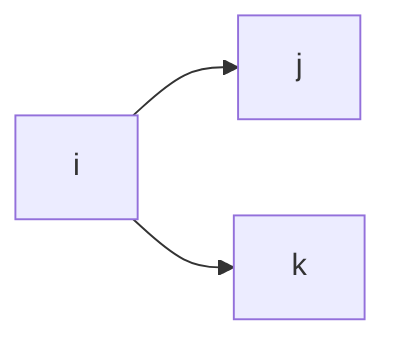
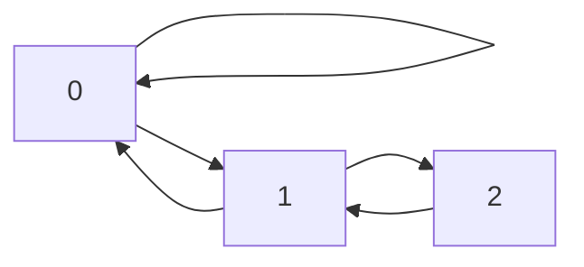
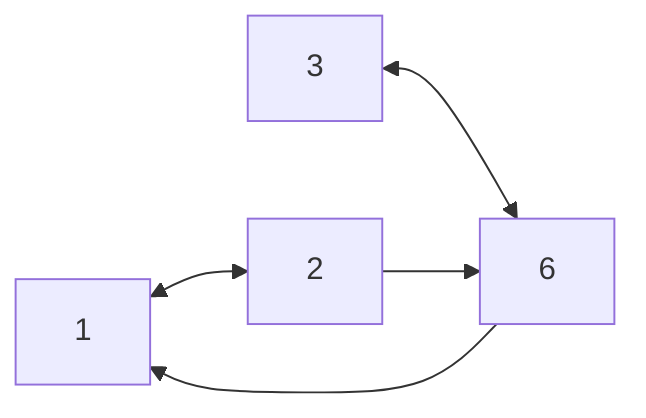

# Graph
Many data makes more sense if you arrange it as a graph. You can extract more information.

- What does a *node* represent?
- What does an *edge* represent?
	- Can be undirected or directed

In this course, we focus on ==Large Graph Processing==
- Apache Giraph – built just to do graph processing
- Spark

==Graph database==
- A combination of graph processing and graph database
- `neo4j`
- Syntax is similar to SQL

---

# PageRank
>> A simplified version of PageRank

>[!note] Web as a directed graph
>**Nodes** : webpages
>**Edges** : hyperlinks

---
## Ranking pages
All web pages are not equally **important**. How to measure the *importance* of pages for search recommendation?

>[!example]
>`wikipedia` is being referenced by a lot of other websites (other websites have hyperlinks to `wikipedia`)
>
>Websites such as `nus.edu.sg` will have less hyperlinks directed to it.
>
>$A → B$ implies that there exists a hyperlink in $A$ that directs to $B$

### Links as votes

If many other webpages have a hyperlink directed to a webpage, the webpage will have more votes.

This assumes that incoming links are harder to manipulate.

==**Problem**==
Users can create a huge number of *dummy* web pages to link to their page to amass votes and drive up its ranks.

==**Solution**==
Make the number of votes that a page has proportional to its own importance. The dummy pages will have low importance and contribute little votes. In other words, the votes do not have equal weights.


If a very important page, $A$, has a vote for another page $B$, $B$ will also become a very important page.

---
## Voting forumlation
1. Each link’s vote is proportional to the ==importance== of the source page
2. For each page $i$, define its *importance* as $r_i$
3. If page $j$ with importance $r_j$ has $n$ out-links, each link gets ${r_j}/{n}$ votes

>[!note]
>The *importance* is distributed evenly to its outgoing neighbours

Importance of page $j$ is the sum of the votes on its incoming links

$$
r_j = \sum_{i \rightarrow j} \frac{r_i}{d_i}
$$
---

## Solving flow equation
Usually, the flow equation will not have
- a unique solution
- all solutions are rescalings of each other

$\implies$ **Add additional constraint to force uniqueness**
$$
r_0 + r_1 + ... + r_n = 1
$$
>[!caution]
>Solving the equation by substitution is not efficient for large web-size graph. ie $n$ is very large

---

## Matrix formulation
Formulate pages as a matrix $M$ with the relationship between each web pages.

$$
M = \begin{bmatrix}
a_{11} & ... & a_{1i} & ... & a_{1n} \\
. & . &. & . & . \\
a_{j1} & ... & a_{ji} & ... & a_{jn} \\
a_{k1} & ... & a_{ki} & ... & a_{kn} \\
\end{bmatrix}
$$
such that, for page $i$ with $d_i$ outgoing links,
- If $i → j$, then $M_{ji} = 1/d_i$
- Else, $M_{ji} = 0$

>[!note]
>Column sum of $M$ must add up to 1

Suppose web page $i$ has links to web page $j$ and $k$



Then in matrix $M$, $d_i = 2$ and $M_{ji} = 1/2$ and $M_{ki} = 1/2$

>[!note]
>In other words, each row $i$ represents the pages that are voting for $i$

>[!caution]
>There are scenarios where the column sum does not add up to 1

Let $r_i$ be the importance of page $i$
$$
\sum_i r_i = 1
$$
The total sum of importance of all web pages in the graph must add up to 1.

Finally,
$$
r = M \cdot r
$$
where $r$ is a column vector and $r_j$ represents the importance of page $j$

And, is equivalent to
$$
r_j = \sum_{i \rightarrow j} \frac{r_i}{d_i}
$$
---

### Example

For a small graph



The matrix formulation $M$ will be,
$$
M = \begin{bmatrix}
½ & ½ & 0 \\
½ & 0 & 1 \\
0 & ½ & 0
\end{bmatrix}
$$
The importance of each page, given by $r$ is
$$
r = 
M \cdot
\begin{bmatrix}
r_0 \\
r_1 \\
r_ 2
\end{bmatrix}
$$
which we can solve efficiently with ==Power iteration==

---
## Power iteration
Given a graph with $n$ nodes, where nodes are web pages and edges are hyperlinks

1. Initialise $r^{[0]} = [ 1/n, …., 1/ n]^T$
	1. Here, we assume that all webpages initially have equal importance
2. Iterate
	1. $r^{[t+1]} = M \cdot r^{[t]}$
3. Stop when $|r^{[t + 1]} - r^{[t]}| < \epsilon$

---
## Random Walk
>[!note] This is a different interpretation

Imagine a random web surfer.
- $t = 0$ Start a a random page
- At any time $t$, surfer is on some page $i$
- At time $t + 1$, the surfer follows an outgoing link from $i$ uniformly at random
- Repeats indefinitely

Let
- $p(t)$ be the vector whose $i$-th element is the probability that the surfer is on page $i$ at time $t$
$\implies$ $p(t)$ is a probability distribution over pages

For a small graph


$$
p(0) = [ ⅓, ⅓, ⅓ ]
$$
Then, construct a matrix $M$ where the element $m_{ij}$ represents the probability that surfer on $j$ will go to web page $i$.

Probabilities converge as $t \rightarrow \infty$, which are also the PageRank scores

---
# Teleports
## Convergence
### Dead ends
- Some pages are ==dead ends==
- Pages with **NO** outgoing links
- Random walker will be stuck at the page forever
- Such pages cause importance to *leak*
- Total summation of the column in the $M$ will be $0$ –> not stochastic
- **At $t \rightarrow \infty$, all web pages will have importance of $0$**
### Spider traps
- More than ≥ 1 nodes
- All out going links are within the group
- Random walk will only walk within the group
- Total summation of column in $M$ still adds up to $1$
- **At $t \rightarrow \infty$, the *spider trap* will absorb all importance** (ie importance 1)
- Nodes outside the spider trap, will converge to $0$

>[!caution] 
>In spider trap, there is no *leakage* as columns of the matrix adds up to $1$ $\implies$ $M$ is still a stochastic matrix

>[!note]
>If a node has an outgoing link to itself, it is considered a spider trap.

---
## Teleport

**Key idea**
At each step, the random surfer has 2 options:
- with probability $p$, follow a link with equal probability
- with probability $1-p$, jump to some random page, including itself

>[!note] Common values of $p$
>Common values of $p$ are in the range $0.8$ to $0.9$

### Dead ends
If the node is a dead end, ==always teleport,== including itself.

In other words, for each dead end, we can preprocess by making the node connected to every other node, including itself.

### Spider traps
Allow teleport from nodes to get out of spider trap in a finite number of steps

---


---

# Problems with PageRank

- Measures **generic** popularity of a page
	- Topic-specific PageRank
- Use a single measure of importance
	- Models of importance (Hubs-and-authorities)
- Susceptible to link spam
	- Prevent artificial link topologies created in order to boost page rank
	- TrustRank, ensure artificial links cannot be used to boost page rank

---

# Topic-specific PageRank

>[!note] How to measure popularity within a topic?
>Instead of measuring popularity based on hyperlinks, if a page is about a certain topic, how close are they to particular topic?

This allows users to query based on interests instead of generic popularity.

## Key idea
Random walker has a small probability of teleporting at any step. Instead of teleporting to other pages with equal probability, topic specific PageRank limits the set of pages to teleport to that are relevant to the topics of interest. This is known as the *teleport set*.

>[!note] Bias the random walk


1. When a random walker teleports, it picks a page from a set $S$
2. $S$ contains only pages that are relevant to the topic
3. For each teleport set $S$, we get a different importance vector $r_s$
	1. In other words, the rank is related to a specific topic, given by pages in the teleport set $S$

Therefore, for different topics, there will be different $r$ vectors.

## Matrix formulation


>[!caution]
>In this course, consider equal probability within $S$

## Example
Suppose for the graph below, $S = \{ 1 \}$ and $\beta = 0.8$. In other words, there is $0.2$ probability that a random surfer will teleport to node 1.


Then, we have

$$
A = \begin{bmatrix}
0.2 & 1 & 0.2 & 0.2 \\
0.4 & 0 & 0 & 0 \\
0.4 & 0 & 0 & 0.8 \\
0 & 0 & 0.8 & 0
\end{bmatrix}
$$
$$
r = \begin{bmatrix}
0.25 \\
0.25 \\
0.25 \\
0.25
\end{bmatrix}
$$

Upon convergence, node 1 will have the highest importance value.

Setting a different $\beta$ value will result in different order of importance of pages.

>[!note]
>Standard PageRank is a special case of topic-specific PageRank where $S$ is all the nodes in the graph

---

## Topics
- User context topics
	- query is launched from a web page talking about a known topic
	- history of queries, *basketball* followed by *Jordan* → most likely to be related to sports topics
	- user’s bookmarks
- Picking from a menu
- Classify query into a topic

---

# Implementation

>[!note] Common features of graph algorithms
>- Local computations at each vertex
>- Passing messages to other vertex

---

## Think like a vertex
Algos are implemented from the view of a single vertex, performing one iteration based on messages from its neighbours

---

## Pregel
>[!note] Google’s graph processing engine

- Computation consists of a series of *supersteps*
- In each superstep, the framework invokes a user-defined `compute`, for each vertex.
- At a single vertex $v$ and superstep $s$, `compute`
	- read messages sent to $v$ from $s-1$
	- send messages to other messages for $s + 1$
	- read or write value of $v$ and the value of its outgoing edges

**Termination**
- $v$ can choose to deactivate itself
- Is active when new messages are received
- Computation halts when **ALL** vertices are inactive
- Also possible to specify the number of iterations

---

## Example
Given a network of nodes, find the maximum over the values in the vertices in the graph



### Approach
- Each vertex repeatedly sends its current value to its neighbours as *messages*
- Each vertex update its value to the maximum over its own value
- The process continues until all vertex values stop changing


The `compute` function is user defined and is executed distributedly among all the nodes.
```python
def compute(v, messages):
	changed = False

	for m in messages:
		if v.getValue() < m:
			v.setValue(m)
			changed = True

	if changed:
		for neighbour in v:
			sendMessage(neighbnour, v.getValue())
	else:
		voteToHalt()
```


- Each vertex only needs to communicate with its direct neighbours
- Every vertex performs distributed computing

After $n$ supersteps, all the vertices will converge to a result

---

# Pregel
- Master and worker architecture
- Not possible to store the entire graph in one worker node
- Vertices are *hash partitioned* and assigned to workers (*edge cut*)

## Checkpoint
- Checkpoint to persistent storage after each superstep
- Failure detected through heartbeats
- Corrupt workers are reassigned and reloaded from checkpoints

## PageRank in Pregel
**Superstep 0**
- Initialise with initial PageRank value

**Superstep 1**
- Invoke `compute()`
- If a node’s rank changes, send message to outgoing neighbours

---
