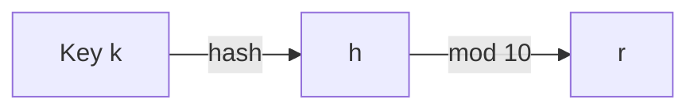

# Typical Big Data Problem
- Iterate over a large number of records
- Extract something of interest from each
- Shuffle and sort intermediate results
- Aggregate intermediate results
- Generate final output

**Map** : Extract something of interest from each
**Reduce** : Aggregate intermediate results

>[!note] 
>Which steps require inputs from the user and which steps can just be an interface?

>[!example] Tabulating election results form multiple polling sites
> Multiple voting stations (multiple chunks) 
>- Need to aggregate vote counts from the voting stations
>
>**Map**
> - Map output : `party:count` value
> 
> **Shuffle**
> - Collect the outputs from `map` results
> - Sort
> 
> **Reduce**
> - Sum the counts
> 
> 

Therefore, the programmer needs to specify the *map* function and *reduce* function
- $map(k_1, v_1) → List(k_2, v_2)$
- $reduce(k_2, List(v_2)) → List(k_3, v_3)$
	- All values with the same key are sent to the same reducer

User needs to define what should be the key and the value interested.

## MapReduce runtime
- Handles scheduling – assigns workers to map and reduce tasks
- Handles *data distribution* – moves processes to data
- Handles synchronisation – gathers, sorts and shuffles intermediate data
- Handles errors and faults – Detects worker failures and restarts
- Happens on top of a distributed file system

>[!note]
> - **(1) submit**: Submits to *master* node
>	- Decides how many map tasks and reduce tasks according to the number of machines available
>	- User can override by defining the configurations
> - **(2) schedule**: 
>	- Schedule for *map* happens first then schedules reduce tasks *after* map tasks are finished
> - **(3) read**: Input files are separated
> 	- Into splits around $128MB$ each
> 	- Each split corresponds to one map task
> 	- Worker execute map tasks 1 at a time
> 	- Can be a local read or a remote read from another machine
> 	- Best effort to allocate task close to the data for local read
> - **Map phase**
> 	- Each worker iterates over each `key, value` pair in its input split.
> 	- Computes the map function on each tuple
> - **(4) local write**
> 	- Output of the `map` function is written to an intermediate file on its own local disk
> 	- These files are partitioned by key
> - **(5) remote read** 
> 	- Each reduce worker is responsible for 1 or more keys
> 	- For each key, it reads data from the corresponding partition of each mapper’s local disk
> 	- **The machines for reduce task can be the ==same== machines for map task**
> 		- Incurs disk I/O on the local disk
> 		- This is because there is a barrier between map and reduce task
> 	- The machines can also be ==totally different==
> 		- goes thru the network (incurs network I/O)
> 		- Before `reduce` is scheduled, there may be other tasks
> 		- Then, machines previously used for `map` tasks are scheduled for other tasks that is not `reduce` tasks
> 	- **reduce phase**
> 		- For each `key, value` list, the `reduce` function is called once
> - **(6) write**
> 	- Written to HDFS, a distributed file system

>[!caution]
>Assume that there is a strict barrier between the map and reduce tasks.
>	This may actually result in underutilization of machines

>[!note] What disadvantages are there if the size of each split (or chunk) is too big or small?
>Hard disk usually read $4KB$ at a time. Utilize disk bandwidth with sequential access.
>Too small → Too much random access
>High overhead (master node may be overwhelmed by scheduling work)
>
> Too big ($1GB$)
> Not taking advantage of parallelism

>[!note] 4: Why `map` writer writes to local hard disk? Why not write to other machines?
> - **Problem with writing to main mem**
>	- Volatile
>	- Less reliable
>	- Lower capacity
> - Hard disk has more capacity and less volatile as it is persistent 
> - The bandwidth of network is limited and writing to other machines incurs bandwidth cost
>	- Writing to hard disk is faster than incurring the bandwidth cost

>[!note] 6: Reduce `write` can be local write or remote write to other machines
>Output file will go to a distributed file system.
>**Why?**
>Refer to [Hadoop File System](MapReduce.md#Hadoop%20File%20System)

## Terms
- ==Worker== is a component of the cluster that performs storage and processing tasks
- ==Map task== is a basic unit of work, typically $128MB$. At the beginning, the input is broken into splits of 128MB. A map task is a job requiring to process 1 split, not a worker
- **A single worker can handle multiple map tasks**. Typically, when a worker completes a map task, it is assigned to another task
- ==Mapper== and ==Reducer== will generally refer to the *process* executing a map or reduce tasks, not to physical machines / workers
- ==Map function== is a *single* call to the user defined `map` function. A single map task can call the map function multiple times

---

Programmers specifies `map` and `reduce` functions. The execution framework handles everything else.

Optionally, specify
- `partition`
- `combiner`
functions. The main objective of these specs are to reduce network traffic

---
## Partition by hash

>[!example]
>In the above example, key `A` went to `reducer 1` and key `B` went to `reducer 2`

Assignment of keys to reducers is determined by a ==hash function==

- Key $k$ goes to reducer $hash(k) \mod n$
where $n$ is the number of reducers

*Optionally*, implement a custom partition to better spread out the load among reducers (if some key have much more values than others)

- Partitioner determines which keys are processed on which **REDUCERS**
- Partitioner can improve performance when some keys are more common than others
- Partitioner runs between the map and reduce tasks

---
## Combiners

>[!note] Key motivation
>Writing `map` output to disk is expensive. Reduce disk writes

- Combiners *locally* aggregates output from mappers
- Combiners may be *mini-reducers*

Notice that there are *fewer* number of key-value pairs that `reducer` have to read.

### Correctness of Combiner
- Combiner does not affect the correctness of the final output, whether the combiner runs 0, 1 or multiple times

**In general**, it is correct to use *reducers as combiners* if the reduction involves a binary operation that is both
- **Associative** : $a + (b + c) = (a + b) + c$
- **Commutative**: $a + b = b + a$

---
# Hadoop File System

>[!note] Precuror
>
>
>**Compute nodes** have high CPU and memory –> suitable for processing tasks. However, this violates the ==bring process to the data principle==
>
> **Storage nodes** have weak CPU and rich disk
>
>**Why did it make sense?**
>Tasks are computationally expensive with small input data and a lot of computation.
>**Example: weather forecast to simulate 1000 years**

**Today**
Tasks today involves a lot of data but is not computationally expensive
- Example: video streaming

Compute *and* storage are demanding today.

Therefore, the above architecture is no longer suitable → combine the compute and storage

>[!note] Don’t move data to workers, move processing to the data

## Assumptions
- **Commodity hardware instead of *exotic* hardware**
	- Scale *out*, not *up*
- **High component failure rates**
	- Inexpensive commodity components fail all the time
	- Failures are not an exception — can be hardware or software
	- Many tasks and machines → a lot of possible software and hardware failures
- ***Modest* number of huge files**
	- Number of files and size of files
	- *Huge* : Scale of 1000GB or more
	- Example : 10 files in the petabytes range
- **Files are write-once, mostly appended to**
	- Data does not usually change
	- Records are usually appended
- **Large streaming reads instead of random access**
	- Sequential access over random access
	- High sustained throughput over low latency

## Design decisions
- **Files stored as chunks (split)**
	- Fixed size (64MB for GFS and 128MB for HDFS)
	- Utilise the bandwidth of the hard disk
- **Reliability through replication**
	- Each chunk replicated across 3+ chunkservers
		- *Why not more?* For $n$ replication:
			- The storage overhead can be quite large
			- Synchronisation: If there are any appends, there need to be $n$ appends
			- Wastes a lot of IO. All the copies are on hard disk. So there needs to be $n$ times of IO
		- *Benefits*
			- Better IO: $n$ places to choose when reading data
			- More flexibility of scheduling: A process has $n$ places to choose the processing
	- For each data, there are 2 other copies in the cluster
	- Can tolerate up to 2 failures
- **Single master to coordinate access, keep metadata**
	- Simple centralised management

---
# HDFS architecture

**HDFS namenode** does not store the actual data. There is only $1$ namenode It only stores the *information* about the data:
- Number of chunks
- Location of each chunk
- Replication
- space management

**Actual** data is stored in the **datanode**. There can be $n$ datanodes.

**Maintaining overall health** (by the `namenode`)
- Periodic communication with the `datanodes` (the heartbeat)
- Block re-replication and re-balancing
- `namenode` wishes to perform *garbage collection*

>[!example] Read
>1. `Client` sends path to the `namenode`
>2. `namenode` sends the location back to the `client`.
>3. Given the location, `client` reads from the `datanode`
>4. `Datanode` responds with the data to the `client`

>[!caution] Actual data never passed through the `namenode`
>Only the control information passes through the `namenode`
>Actual read and write only happens in the `datanode`

>[!note] How to perform replication when **writing** data?
>Client uploads a chunk to a `datanode`
>`namenode` decides which `datanodes` are to be used as replicas. The 1st `datanode` forwards data blocks to the 1st replica `datanode`, which forwards them to the 2nd replica `datanode`, and so on.

>[!note] What if the `namenode`’s data is lost?
>All files on the FS cannot be retrieved since there is no way to reconstruct them from the raw block data. Hadoop provides 2 ways of backup : through backups (replication) and secondary `namenode`

`datanode daemon` and `namenode daemon` communicates with each other about the health, heartbeat etc.

`job tracker` tracks the progress of the execution of the job in the `map` phase or the `reduce` phase

`tasktracker` coupled to `datanode` → they are on the same physical machine. The storage and compute are in a single node.

`namenode` and `job submission node` can be on the ==same physical machine== or on ==different machines==

----