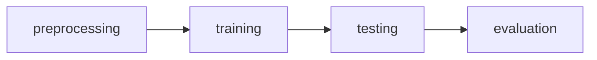

# Motivation


# Spark

- Big data processing solution
- Leaves storage to users
- Considered an improvement from Hadoop foundation

## Spark design philosophy
- Speed
	- Expected to handle large amounts of data in parallel
- Ease of use
	- In comparison to hadoop MapReduce
- Modularity
	- Different modules targeting different fucntions
- Extensibility
	- Spark is a processor / compute engine
	- Does not give storage solution
		- Difficult to move data storage form one place to another
		- Many organisations do not wish to move data
		- Can connect to HDFS, SQL, NoSQL, Delta Lake etc

>[!note]
>Hadoop is compute + storage solution.
>
>Now, most approaches decouple compute from storage solutions


![[Screenshot 2024-04-21 at 11.56.31 AM.png]]
---
# Motivation
## Hadoop vs Spark

### Issues with MapReduce
- Network and disk I/O costs
	- intermediate data has to be written to local disks and shuffle across machines, which is slow
	- Not suitable for **iterative** algorithms and processing
	- Each iteration requires 1 read from HDFS and 1 write to HDFS
### Advantages of Spark
 **Spark** stores most of its intermediate results in *memory*, making it much faster, especially for iterative processing
 
 >[!note]
 >When mem is insufficient, Spark spills to disk which requires disk I/O

- Ease of programmability
	- Not a trivial problem for Java Hadoop
- Spark core and Spark SQL engine supports different languages
- Batch processing –> Very efficient with Spark SQL
- Streaming and Graph processing –> Not very efficient
- ML (iterative algorithms) –> Still good

---
# Basics

## Spark architecture


**Driver process**
- Accepts the requests from user and start a Spark session
- Assigns a job to executor

**Executor**
- Performs jobs in parallel

**Cluster manager**
- How many jobs can be assigned to a machine
- Can be Spark’s standalone cluster manager, YARN, or K8s

**Local mode**
- All the processes run on the same machine

---

## Spark APIs
### Resilient Distributed Datasets (RDDs)
- A collection of JVM objects
- Functional operators (map, filter, etc)

### DataFrame
- A collection of Row objects
- Expression-based operations
	- Much easier than functional operators
- Logical plans and optimiser

### DataSet
- Internally : rows
- Externally : JVM objects

---

# RDDs
- **Resilient** : Achieve fault tolerance through ==lineages==
- **Distributed Datasets**: Represents a collection of objects that is ==distributed over machines==

```python
# Create an RDD of names, distributed over 3 partitions
dataRDD = sc.parallelize(['Alice', 'Bob', 'Carol', 'Daniel'], 3)

# Create an RDD: length of names -- transformation
nameLen = dataRDD.map(lambda s: len(s))
```
- ==Immutable== : Cannot be changed once created
- Therefore, we need ==transformations==

### Transformations
Transformations are a way of transforming RDDs into RDDs.
- Examples of transformations:
	- `map`
	- `order`
	- `groupBy`
	- `filter`
	- `join`
	- `select`

In Spark, transformations are *lazy*. Not executed until an ==action== is called on it.

```python
# Create an RDD of names, distributed over 3 partitions
dataRDD = sc.parallelize(['Alice', 'Bob', 'Carol', 'Daniel'], 3)

# Create an RDD: length of names -- transformation
nameLen = dataRDD.map(lambda s: len(s))

# Action - Retrieve all elements of the RDD to the driver node
nameLen.collect()
```

>[!note]
>If there is no *action*, Spark will just create a ==lineage==

>[!note] Why lazy transformation?
>Spark is a big data system. Therefore, it needs to execute in the most efficient way. If there are many transformations, Spark will optimise by reordering for example, to improve its efficiency.


## Working with RDDs

*Starting point* must be from a persistent storage (HDFS, DB, etc)

- Each line creates a lineage that is not executed until an action is called.

---

# Caching

>[!example]
>Load error messages from a log into memory, then interactively search for various patterns
>

```python
lines = sc.textFile("hdfs://...")
errors = lines.filter(lambda s: s.startswith("ERROR"))
messages = errors.map(lambda s: s.split("\t")[2])
messages.cache()

messages.filter(lambda s: "mysql" in s).count() # action
messages.filter(lambda s: "php" in s).count() # 2nd action
```

1. Driver node sends tasks to workers
2. Each worker
	1. Read the file
	2. Perform transformations
	3. Cache data
	4. Calculate count and send to driver

With `cache`, the worker can directly use the file from cache and send back to the driver node.
Without `cache`, the 2nd action will start from the driver node

>[!note]
>Reading from memory is faster than reading from disk

#### `cache`
- Saves an RDD to memory *of each worker node*

#### `persist`
- Can be used to save an RDD to memory, disk or off-heap memory

### When to cache?
- When it is expensive to compute and needs to be re-used multiple times
- If worker nodes do not have enough memory, they will evict the ==LRU== RDDs.

---

# Directed Acyclic Graph
- Internally, Spark creates a graph which represents all the RDD objects and how they will be transformed
- *Transformations* constructs this graph
- *Actions* trigger computations on it

This lineage transformation with DAGs is how Spark achieves fault tolerance.

```scala
val file = sc.textFile("hdfs://...")
val counts = file.flatMap(line => line.split(" "))
				.map(word => (word, 1))
				.reduceByKey(_ + _)
counts.save("...")
```

---
## Dependencies

### Narrow dependencies
- Each partition of the parent RDD is used by at **most** one partition of the child RDD. Does not need information from other partition.
	- `map`, `flatMap`, `filter`, `contains` 
	- For example, from the error log example:
		- Parent RDD: `lines`
		- Child RDD: `erorrs`

### Wide dependencies
- Each partition of parent RDD is used by multiple partitions of the child RDD
	- `reduceByKey`, `groupBy`, `orderBy`
- If 1 parent partition communicates with more than 1  child partition
- Requires shuffling
- Need to get info from other worker machines

---
## Stages
Consecutive ==narrow== dependencies are grouped together as *stages*.

### Within stages
Spark performs consecutive transformations on the **same** machines

### Across stages
Data needs to be **shuffled**, exchange across partitions
- Involves writing intermediate results to disk

>[!note]
>Minimising shuffling is good practice for improving performance

---
### Example

```python
df1 = spark.range(2, 1000000, 2) # transformation -- narrow
df2 = spark.range(2, 1000000, 4) # transformation -- narrow

df3 = df1.join(df2, ["id"])      # transformation -- wide

df3.count()                      # action
```
- If the output is an RDD, it is a *transformation*
- `join` is a wide transformation
	- Need to look through all rows with a particular id
	- Need to match and shuffle across the table

---

# Lineage and fault tolerance

- Spark does not use replication to allow fault tolerance
- Spark tries to store all data in memory, not disk.

**Lineage approach** : if a worker node goes down, we replace it by a new worker node, and use DAG to recompute the data in the lost partition
- Only need to recompute RDDs from the lost partition

---
# DataFrames

- A DataFrame represents a table of data, similar to tables in SQL or DataFrames in `pandas`
- Tells Spark what to do, instead of *how* to do it
- Code is far more expressive as well as simpler
- Spark can inspect or parse this query to understand the user’s intention. It can then optimise or arrange the operations to make it more efficient

Compared to RDDs, this is a higher level interface. Transformations resemble SQL operations.

>[!caution] 
>All DataFrame operations are still ultimately compiled down to RDD operations by Spark

>[!note] RDD vs DataFrame
> RDD level API requires you to use functional operators and tell Spark exactly what to do step by step.
> 
> DataFrames are expression based and requires users to tell Spark what they want

---

# Spark SQL
- **Spark Core and Spark SQL Engine**
	- SQL does not imply SQL language. It just means relational operation.
- Unifies Spark components and permits abstraction to DataFrames in Java, Python, and R
- This is because most business data are in tabular format
- Keeps track of schema and support optimized relational operations

![[Screenshot 2024-04-21 at 12.05.38 PM.png]]

1. Spark SQL engine gets users’ queries
2. Try to understand what user wants to do
3. ==Catalyst optimiser== optimises logical and physical plan
4. ==Tungsten== generates RDD level code which is already optimised

## Catalyst optimizer

![[Screenshot 2024-04-21 at 12.07.38 PM.png]]

Takes a computational query and converts it into an execution plan through 4 transformational phases:
1. Analysis
2. Logical plan
3. Physical planning
4. Code generation

==Optimised logical plan== may not necessarily follow the logical plan that you have defined. Spark helps you to re-sequence and reorder.

==Physical plan== defines how to exactly execute this code → creates a cost model and selects physical plan based on the cost model.

>[!example]
>```python
>usersDf = read(“…”)
>eventsDf = read(“…”)
>
>joinedDf = users
>	.join(events, users.id == events.uid)
>	.filter(events.date > “2015-01-01)
>```
> As users, we do not have to worry about which operation is carried out first. However, Spark will re-sequence for:

![[Screenshot 2024-04-21 at 12.15.43 PM.png]]


## Tungsten
- Substantially improve the memory and CPU efficiency of Spark applications
- Push performance closer to the limits of modern hardware

### Approach
- Memory management and binary processing
- Cache-aware computation
	- Based on lineage, Spark will detect dataframe which are used later and caches for you. 
- Code generation

---

# Spark ML

## Classification
- Categorise samples into classes, given training data
## Regression
- Predict numeric labels, given training data

---

## Typical ML pipeline



>[!note]
>Here, we focus on `preprocessing` stage of the pipeline

---

## Data quality
### Missing values
- Causes
	- Information was not collected
	- Missing at random –> Missing values are randomly distributed
	- Missing **not** at random –> the missingness itself may be important information
- Handling missing values
	- Eliminate rows with missing values
	- Impute the missing values
		- Based on the **mean/ median** of the missing values
		- Fitting a regression model to predict the attribute given the other attributes
		- Dummy variable: optionally insert a column which is `1` if the variable was missing and `0` otherwise. This can be an interesting feature.

### Categorical encoding
ML models will only take in numerical features. ==Categorical features== need to be converted to numerical features.

#### One hot encoding
- Convert discrete feature to a a series of binary features.
- For example, when the 3 `groups` do not imply any order or ranking (ordinal relationship)
- Therefore, `OHE` creates 3 columns

### Normalization
Many ML models prefer numbers to be in a small range represented by small floating number.

==Normalize== the numbers to fit in a small range
- `StandardScaler`
- `MinMaxScaler`

---
## Main idea
- ML involves fitting the *parameters* of a model by minimizing a loss / cost function

### Gradient descent
- Minimise $J$, the cost function.

Find $w$, $b$ to minimize $J(w, b)$.

- Start at an arbitrary point
- Move following the **steepest** downward gradient
- Continue until convergence
	- Stop when improvement in $J$ is below a fixed threshold

---
## Evaluation

### Evaluating classification model

- ML model is used to classify patients with (positive label) or without (negative label) diabetes

---
## Pipelines
- Build complex pipeline out of simple building blocks (ie encoding, normalization, feature transformation, model fitting)


This allows for better code reuse between training and test pipelines, cross-validation, model varaints etc.

Then, it is also easier to perform cross validation and hyperparameter tuning.


